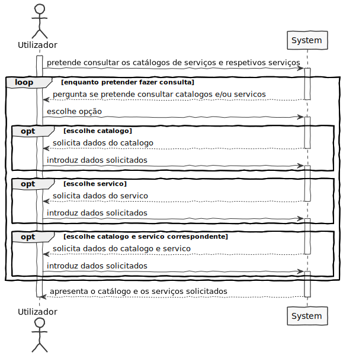
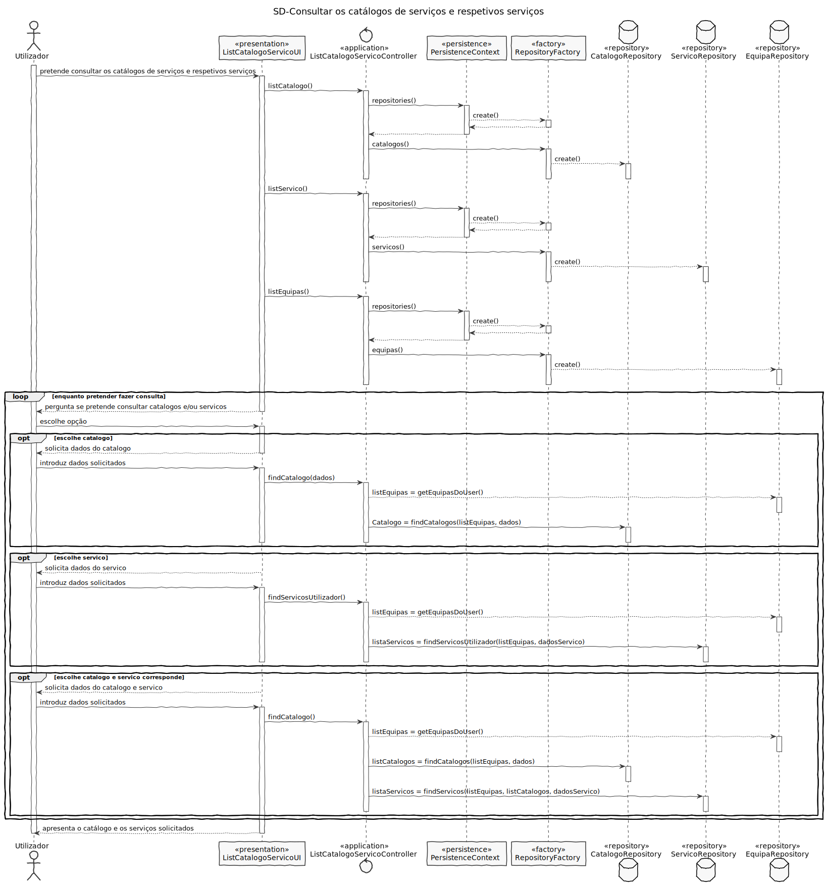
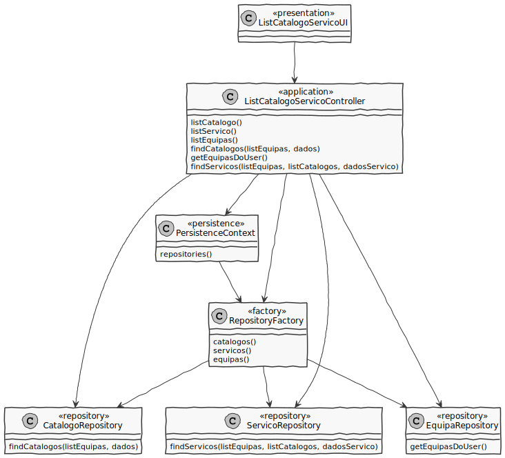
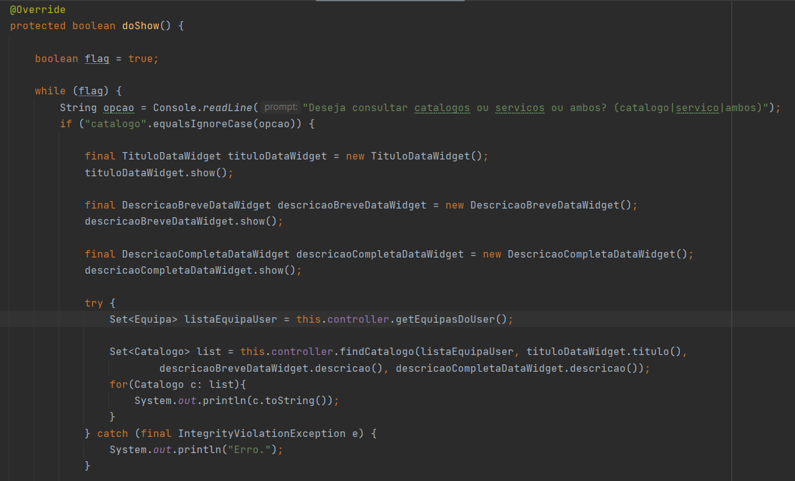
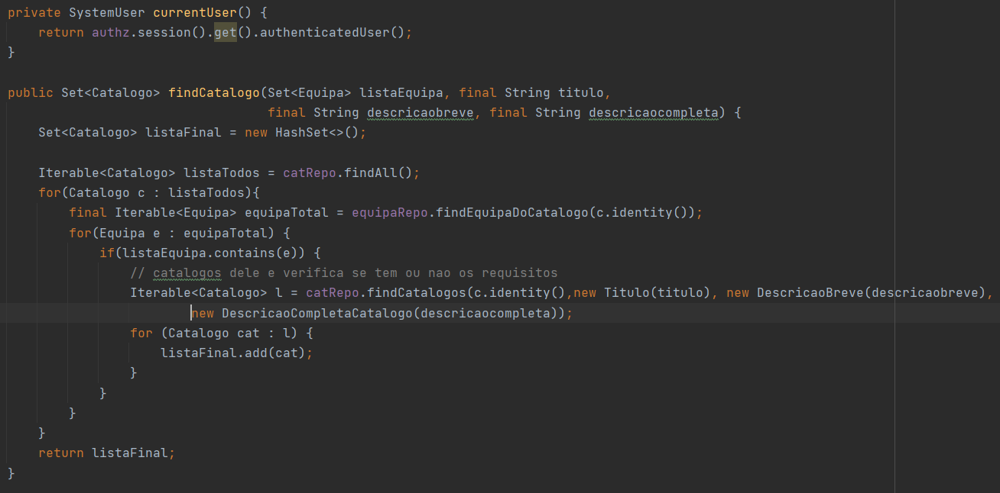

# US3001 - Consultar os catálogos de serviços e respetivos serviços
=======================================

# 1. Requisitos

*Nesta secção a equipa deve indicar a funcionalidade desenvolvida bem como descrever a sua interpretação sobre a mesma e sua correlação e/ou dependência de/com outros requisitos.*

*Exemplo*

**US3001** Como utilizador, pretendo consultar/pesquisar os catálogos de serviços e respetivos serviços que me estão/são disponibilizados

A interpretação feita deste requisito foi no sentido de um utilizador conseguir poder visualizar os catálogos pelos quais é responsável e os serviços disponibilizados para este.

# 2. Análise

*Neste secção a equipa deve relatar o estudo/análise/comparação que fez com o intuito de tomar as melhores opções de design para a funcionalidade bem como aplicar diagramas/artefactos de análise adequados.*
*Recomenda-se que organize este conteúdo por subsecções.*

2.1 Regras de Negócio
* Apenas devem ser apresentados os que estão/são disponibilizados ao utilizador em causa.
* A pesquisa deve ser orientada pelas palavras-chave dos serviços e/ou pelos respetivos títulos e os resultados agrupados pelos respetivos catálogos;
* Deve permitir consultar detalhes de cada um dos resultados da pesquisa;
* Os serviços cuja especificação esteja incompleta podem aparecer sinalizados com a informação "brevemente disponível".

# 3. Design

*Nesta secção a equipa deve descrever o design adotado para satisfazer a funcionalidade. Entre outros, a equipa deve apresentar diagrama(s) de realização da funcionalidade, diagrama(s) de classes, identificação de padrões aplicados e quais foram os principais testes especificados para validar a funcionalidade.*

*Para além das secções sugeridas, podem ser incluídas outras.*

## 3.1. Realização da Funcionalidade

*Nesta secção deve apresentar e descrever o fluxo/sequência que permite realizar a funcionalidade.*

Começamos por criar a ligação ao repositório do catálogo de serviços e ao repositório de serviços para posteriormente um utilizador conseguir poder visualizar os catálogos pelos quais é responsável e os serviços disponibilizados para este.

O utilizador tem a possibilidade de pesquisar apenas por catálogos, por serviços e até por um catalogo específico e um serviço deste catálogo. De seguida, introduz os dados da sua pesquisa e é feita uma consulta no repositório do catálogo de serviços, procurando o catálogo correspondente à pesquisa do utilizador. O mesmo procedimento é feito quando a sua pesquisa é orientada para serviços, usando o repositório do serviço.

## 3.2. Diagrama de Classes

*Nesta secção deve apresentar e descrever as principais classes envolvidas na realização da funcionalidade.*

**ListCatalogoServicoUI**- Classe responsável pela iteração entre o utilizador e o sistema.

**ListCatalogoServicoController**- Classe é responsável por coordenar/distribuir as ações realizadas na User Interface (UI) com o resto do sistema.

**CatalogoRepository**- Retorna um catálogo/lista de catálogos resultante da pesquisa do utilizador.

**ServicoRepository**- Retorna um serviço/lista de serviços resultantes da pesquisa do utilizador, agrupados pelos catálogos consultados.

**EquipaRepository**- Retorna uma lista das equipas do utilizador.

## 3.3. Padrões Aplicados

*Nesta secção deve apresentar e explicar quais e como foram os padrões de design aplicados e as melhores práticas.*

* **Pure Fabrication** - criação da classe UI;

* **Controller** - atribui a responsabilidade de lidar com os eventos do sistema para uma classe que representa a um cenário de caso de uso do sistema global;

* **High cohesion/Low coupling** - menor dependência entre as classes;

* **Factory** - tem a responsabilidade de criar novos objetos;

* **Repository** - tem a responsabilidade de persistir e reconstruir objetos a partir da persistência;

## 3.4. Testes 

# 4. Implementação

## 4.1. UI
Aqui é demonstrado parte do método doShow() existente na UI desta US.

## 4.2. Controller
Aqui é demonstrado o Controller da US com um dos métodos principais

# 5. Integração/Demonstração

# 6. Observações

