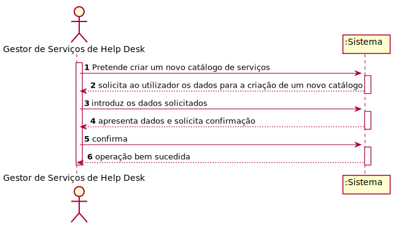
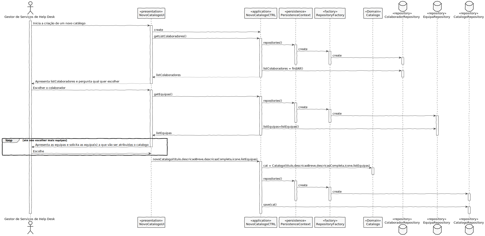
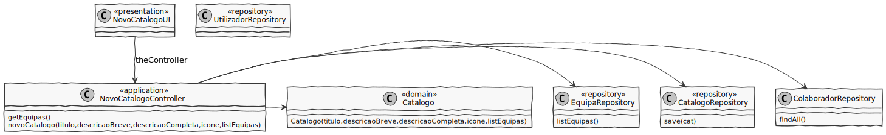

# US2001
=======================================

# 1. Requisitos

**US2001** Como Gestor de Serviços de Help Desk (GSH), pretendo criar um novo catálogo de serviços.

A interpretação feita deste requisito foi no sentido de Gestor de Serviços de Help Desk conseguir criar um novo catálogo de serviços.

# 2. Análise

# Análise

* O catálogo é caracterizado por um identificador, titulo, descrição completa, descrição breve, icone, colaborador responsável e é atribuido a uma equipa ou mais.

# Regras de Negócio

* O identificador é gerado automáticamente.
* A descrição breve do serviço tem um tamanho máximo de de 40 caracteres, enquanto que a descrição completa tem um tamanho máximo de 100 caracteres
* Título tem um tamanho máximo de 50 caracteres.
* Icone não pode estar vazio e tem que ter no máximo 50 carateres
* Tem que existir um colaborador responsável sempre

# 3. Design

##Classes de domínio:

* Catalogo
* Identificador
* Titulo
* DescricaoBreve
* DescricaoCompleta
* Icone
* Equipa
* Colaborador

Identificador é um value object que faz parte do agregado Catalogo

* Relação unidirecional one-to-one
* Cascade ALL
* Fetch EAGER

Titulo é um value object que faz parte do agregado Catalogo

* Relação unidirecional one-to-one
* Cascade ALL
* Fetch EAGER

DescricaoBreve é um value object que faz parte do agregado Catalogo

* Relação unidirecional one-to-one
* Cascade ALL
* Fetch EAGER

DescricaoCompleta é um value object que faz parte do agregado Catalogo

* Relação unidirecional one-to-one
* Cascade ALL
* Fetch EAGER

Icone é um value object que faz parte do agregado Catalogo

* Relação unidirecional one-to-one
* Cascade ALL
* Fetch EAGER

Colaborador é um agregado independente Catalogo

* Relação unidirecional 
* Cascade ALL

Controlador: NovoCatalogoController

Repository: EquipaRepository
	    CatalogoRepository
	    User

## 3.1. Realização da Funcionalidade

## 3.2. Diagrama de Classes

## 3.3. Padrões Aplicados

* **Controller** - atribui a responsabilidade de lidar com os eventos do sistema para uma classe que representa a um cenário de caso de uso do sistema global;

* **Information Expert** - classe possui os seus próprios dados;

* **High cohesion/Low coupling and ** - menor dependência entre as classes.

* **Factory** - tem a responsabilidade de criar novos objetos.

* **Repository** - tem a responsabilidade de persistir e reconstruir objetos a partir da persistência.

## 3.4. Testes 
*Nesta secção deve sistematizar como os testes foram concebidos para permitir uma correta aferição da satisfação dos requisitos.*

**Teste 1:** Verificar que não é possível criar uma instância da classe Exemplo com valores nulos.

	@Test(expected = IllegalArgumentException.class)
		public void ensureNullIsNotAllowed() {
		Exemplo instance = new Exemplo(null, null);
	}

# 4. Implementação

# 5. Integração/Demonstração

*Nesta secção a equipa deve descrever os esforços realizados no sentido de integrar a funcionalidade desenvolvida com as restantes funcionalidades do sistema.*

# 6. Observações

*Nesta secção sugere-se que a equipa apresente uma perspetiva critica sobre o trabalho desenvolvido apontando, por exemplo, outras alternativas e ou trabalhos futuros relacionados.*

