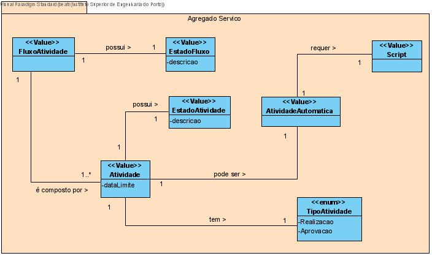
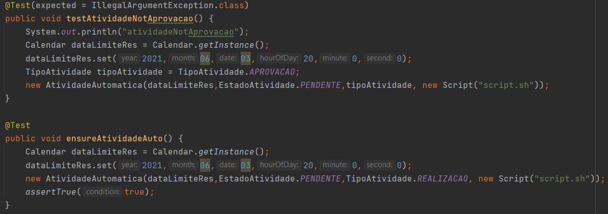

# US1006 - Desenvolver a componente representativa de uma tarefa automática
=======================================

# 1. Requisitos

**US1006** Como Gestor de Projeto, eu pretendo que seja desenvolvida a componente representativa de uma tarefa automática dedicada à execução de um script no âmbito de um pedido e que a mesma seja adicionada à biblioteca de atividades típicas do sistema para, dessa forma, poder ser usada na definição de fluxos de atividades.

A interpretação feita deste requisito foi no sentido de uma atividade automática ter associada a si um script aquando da inclusão da componente num fluxo de atividades.

# 2. Análise

* Um fluxo de atividade assenta no uso de componentes representativos de tipos de atividades (componente representativo de uma tarefa manual e automática)
* Componente representativo de uma tarefa automática a ser realizada pelo sistema
* Tarefa Automática consiste na execução de um script especificado aquando da inclusão do componente num fluxo. 
* Para a execução correta de algumas partes do script (e.g., envio de email) pode requerer a configuração única e centralizada de dados (e.g., o servidor/conta de email por onde os emails são remetidos).
* Uma atividade tem uma prioridade, criticidade e data limite de conclusão associada, tal como um estado da atividade.

# 3. Design

## 3.1. Realização da Funcionalidade

*Nesta secção deve apresentar e descrever o fluxo/sequência que permite realizar a funcionalidade.*

## 3.2. Diagrama de Classes

*Nesta secção deve apresentar e descrever as principais classes envolvidas na realização da funcionalidade.*

## 3.3. Padrões Aplicados

*Nesta secção deve apresentar e explicar quais e como foram os padrões de design aplicados e as melhores práticas.*

## 3.4. Testes 

Aqui é demonstrado que uma atividade automática pode ser do tipo Realização porém não pode ser do tipo Aprovação.

# 4. Implementação

# 5. Integração/Demonstração

# 6. Observações

