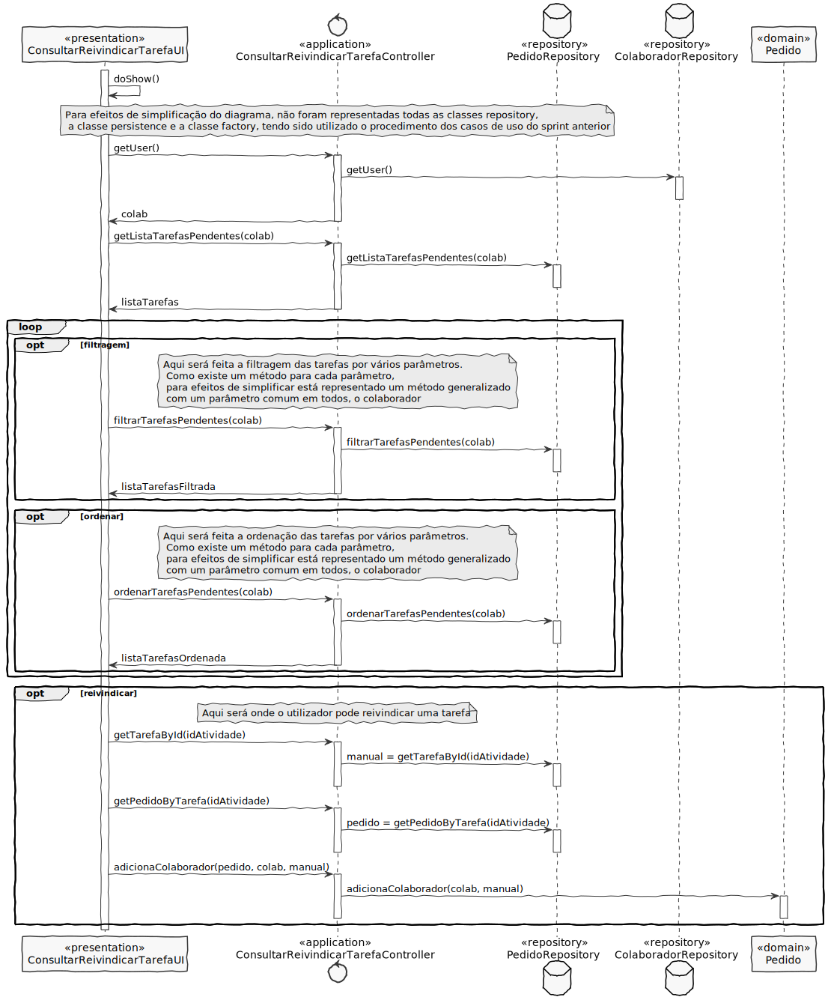

# US3022 - Consultar tarefas pendentes que um utilizador pode reivindicar
=======================================

# 1. Requisitos

**US3022** Como utilizador, eu pretendo consultar as tarefas pendentes que eu posso reivindicar para mim e, caso o deseje, concretize essa reivindicação.

A interpretação feita deste requisito foi no sentido do utilizador ser capaz de consultar todas as tarefas pendentes e se assim entender poder reivindicar uma delas.

# 2. Análise

* Reivindicar a realização de uma tarefa pendente consiste em requer que uma determinada tarefa pendente e ainda não assignada a nenhum colaborador concreto seja assignada ao utilizador.
* Aquando da consulta, as tarefas devem ser apresentadas de modo a que o utilizador tenha uma imediata perceção da prioridade, criticidade e data limite de conclusão de cada tarefa.
* A consulta deve incidir apenas sobre as tarefas que estão assignadas ao utilizador;
* A consulta deve incidir sobre as tarefas que o utilizador pode reivindicar para sua realização (i.e., tarefas que lhe podem ser assignada);
* Em qualquer das situações anteriores deve ser permitido filtrar a informação apresentada e/ou (re)ordenar as tarefas pelos vários campos disponíveis.

# 3. Design

## 3.1. Realização da Funcionalidade

Começamos por reconhecer o colaborador que está a acessar o programa. Em seguida, este utilizador pode consultar as suas tarefas pendentes que possa reivindicar. Esta procura filtra atividades que apenas foram assignadas a equipas, sem ter um colaborador especifico responsável pela sua realização.

A consulta é feita de maneira a que o utilizar se assim pretender possa ordenar e/ou filtrar as suas atividades pendentes.

No final da consulta, o utilizador tem a opção de reivindicar uma das tarefas apresentadas. Este escolhe o id de uma das tarefas representadas e posteriormente é atualizada a tarefa de forma a que tenha como responsável pela sua realização o utilizador em causa.

## 3.2. Diagrama de Classes

**ConsultarReivindicarTarefaUI**- Classe responsável pela iteração entre o utilizador e o sistema.

**ConsultarReivindicarTarefaController**- Classe é responsável por coordenar/distribuir as ações realizadas na User Interface (UI) com o resto do sistema.

**PedidoRepository**- Retorna uma lista de atividades pendentes de um utilizador, filtra e ordena essas mesmas atividades, tal como retorna uma atividade incorporada num pedido e um determinado pedido.

**ColaboradorRepository**- Retorna o colaborador atual na sessão.

**Pedido**- Atualiza o Colaborador responsável pela atividade.

## 3.3. Padrões Aplicados

* **Pure Fabrication** - criação da classe UI;

* **Controller** - atribui a responsabilidade de lidar com os eventos do sistema para uma classe que representa a um cenário de caso de uso do sistema global;

* **High cohesion/Low coupling** - menor dependência entre as classes;

* **Factory** - tem a responsabilidade de criar novos objetos;

* **Repository** - tem a responsabilidade de persistir e reconstruir objetos a partir da persistência;

## 3.4. Testes 

# 4. Implementação

# 5. Integração/Demonstração

# 6. Observações

