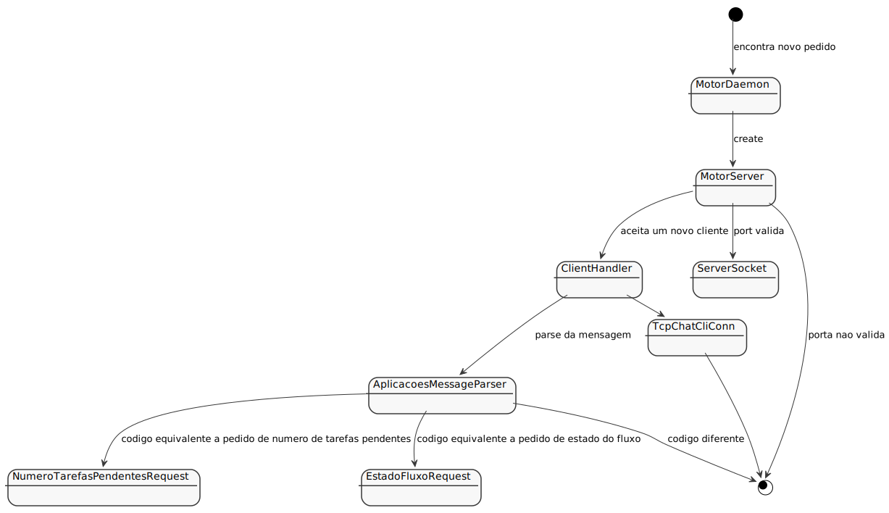

# US4002
=======================================

# 1. Requisitos

**US4002** Como Gestor de Projeto, eu pretendo que o Motor de Fluxo de Atividades disponibilize, a pedido, os dados necessários às aplicações "Serviços e RH" e "Portal dos Utilizadores".

# 2. Análise

* Do dashboard deve constar, entre outras dados, o número de tarefas pendentes do utilizador, quantas dessas tarefas já terminou o prazo limite de resolução indicado no pedido e quantas terminam esse prazo em breve (e.g. em menos de 1 hora), a distribuição dessas tarefas pelos patamares de urgência e de criticidade.
* Serviços RH pretendem obter o estado atual do Motor do Fluxo de atividades.

# 3. Design

## 3.1. Realização da Funcionalidade

## 3.2. Diagrama de Classes

## 3.3. Padrões Aplicados

## 3.4. Testes 

# 4. Implementação

# 5. Integração/Demonstração

# 6. Observações

