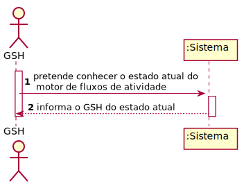

# US2011
=======================================

# 1. Requisitos

**US2011** Como GSH, eu pretendo conhecer o estado atual do motor de fluxos de atividades e que este se mantenha atualizado (automaticamente).

# 2. Análise

* Deve ser usado o protocolo de aplicação fornecido (SDP2021).
* Pretende-se que o estado seja apresentado numa página web disponibilizada por um servidor HTTP existente na aplicação "Serviços e RH" e esteja apenas disponível para o localhost.
* A página web é mantida atualizada sem recarregar.

# 3. Design

## 3.1. Realização da Funcionalidade

## 3.2. Diagrama de Classes

## 3.3. Padrões Aplicados

## 3.4. Testes 

# 4. Implementação

# 5. Integração/Demonstração

# 6. Observações

