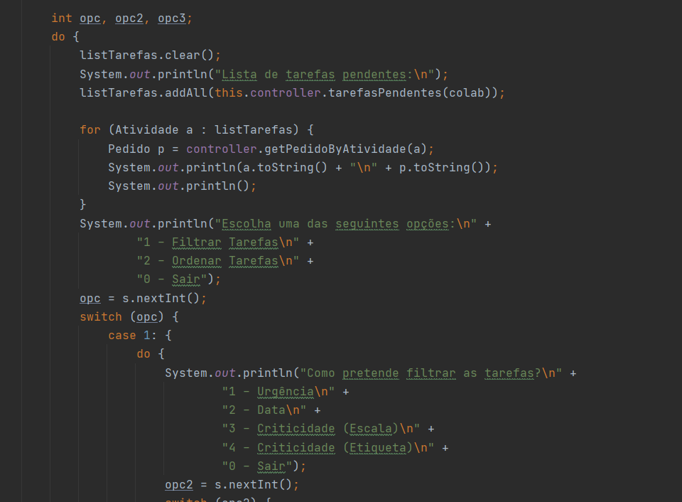

# US3021 - Consultar tarefas pendentes
=======================================

# 1. Requisitos

**US3021** Como utilizador, eu pretendo consultar as tarefas pendentes que me estão assignadas.

A interpretação feita deste requisito foi no sentido do utilizador ser capaz de consultar todas as tarefas pendentes.

# 2. Análise

* Aquando da consulta, as tarefas devem ser apresentadas de modo a que o utilizador tenha uma imediata perceção da prioridade, criticidade e data limite de conclusão de cada tarefa.
* A consulta deve incidir apenas sobre as tarefas que estão assignadas ao utilizador.
* Em qualquer das situações anteriores deve ser permitido filtrar a informação apresentada e/ou (re)ordenar as tarefas pelos vários campos disponíveis.

# 3. Design

## 3.1. Realização da Funcionalidade

Começamos por reconhecer o colaborador que está a acessar o programa. Em seguida, este utilizador pode consultar as suas tarefas pendentes. Esta procura filtra atividades que apenas foram assignadas a ele.

A consulta é feita de maneira a que o utilizar se assim pretender possa ordenar e/ou filtrar as suas atividades pendentes.

## 3.2. Diagrama de Classes

**ConsultarTarefasPendentesUI**- Classe responsável pela iteração entre o utilizador e o sistema.

**ConsultarTarefasPendentesController**- Classe é responsável por coordenar/distribuir as ações realizadas na User Interface (UI) com o resto do sistema.

**PedidoRepository**- Retorna uma lista de atividades pendentes de um utilizador, filtra e ordena essas mesmas atividades, tal como retorna uma atividade incorporada num pedido e um determinado pedido.

**ColaboradorRepository**- Retorna o colaborador atual na sessão.

**Atividade**- Atividade.

## 3.3. Padrões Aplicados

* **Pure Fabrication** - criação da classe UI;

* **Controller** - atribui a responsabilidade de lidar com os eventos do sistema para uma classe que representa a um cenário de caso de uso do sistema global;

* **High cohesion/Low coupling** - menor dependência entre as classes;

* **Factory** - tem a responsabilidade de criar novos objetos;

* **Repository** - tem a responsabilidade de persistir e reconstruir objetos a partir da persistência;

## 3.4. Testes 

# 4. Implementação

Aqui é apresentado uma parte da UI onde permite que o utilizador escolha filtrar e/ou ordenar as tarefas.

# 5. Integração/Demonstração

# 6. Observações

