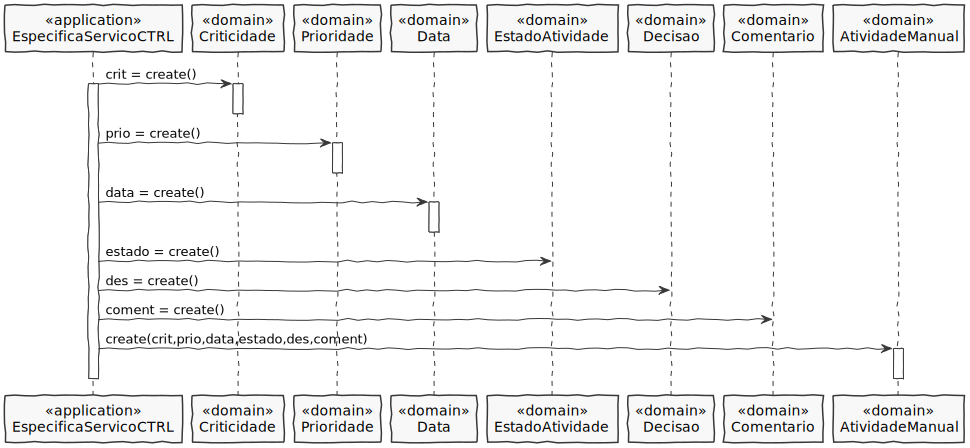
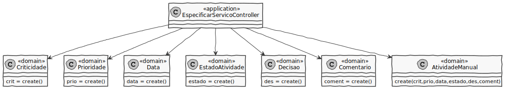

# US1005 - Componente representativa de uma tarefa manual

## 1. Requisitos

**US1005** Como Gestor de Projeto, eu pretendo que seja desenvolvida a componente representativa de uma tarefa manual dedicada à apresentação e recolha de informação a/de um utilizador no âmbito de um pedido e que a mesma seja adicionada à biblioteca de atividades típicas do sistema para, dessa forma, poder ser usada na definição de fluxos de atividades.

## 2. Análise

* Um fluxo de atividade assenta no uso de componentes representativos de tipos de atividades (componente representativo de uma tarefa manual e automática)
* Componente representativo de uma tarefa manual a ser realizada
* Tarefa Manual consiste no preenchimento de um formulário especificado aquando da inclusão do componente num fluxo. 
* Uma atividade manual tem uma prioridade, criticidade, data limite de conclusão, um estado da atividade, uma decisão e um comentário.

## 3. Design

### 3.1 Realização da Funcionalidade

### 3.2 Diagrama de Classes

**EspecificarServicoController**- Classe é responsável por coordenar/distribuir as ações realizadas na User Interface (UI) com o resto do sistema.

**Prioridade**- Cria a instância Prioridade.

**Criticidade**- Cria a instância Criticidade.

**Data**- Cria a instância Data.

**EstadoAtividade**- Cria a instância EstadoAtividade.

**Decisao**- Cria a instância Decisao.

**Comentario**- Cria a instância Comentario.

## 3.3. Padrões Aplicados

*Nesta secção deve apresentar e explicar quais e como foram os padrões de design aplicados e as melhores práticas.*

## 3.4. Testes 

# 4. Implementação

# 5. Integração/Demonstração

# 6. Observações

