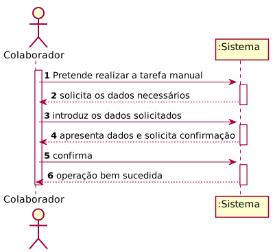

# US1005 - Componente representativa de uma tarefa manual

## 1. Requisitos

**US1005** Como Gestor de Projeto, eu pretendo que seja desenvolvida a componente representativa de uma tarefa manual dedicada à apresentação e recolha de informação a/de um utilizador no âmbito de um pedido e que a mesma seja adicionada à biblioteca de atividades típicas do sistema para, dessa forma, poder ser usada na definição de fluxos de atividades.

## 2. Análise

* Para que um serviço fique completo, é necessária a adição de fluxos de atividade e a validação dos formulários.

### Excerto do Modelo de Domínio relevante para o caso de uso

## 3. Design

### 3.1 Realização da Funcionalidade

### 3.2 Diagrama de Classes

