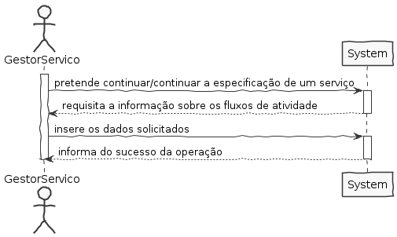
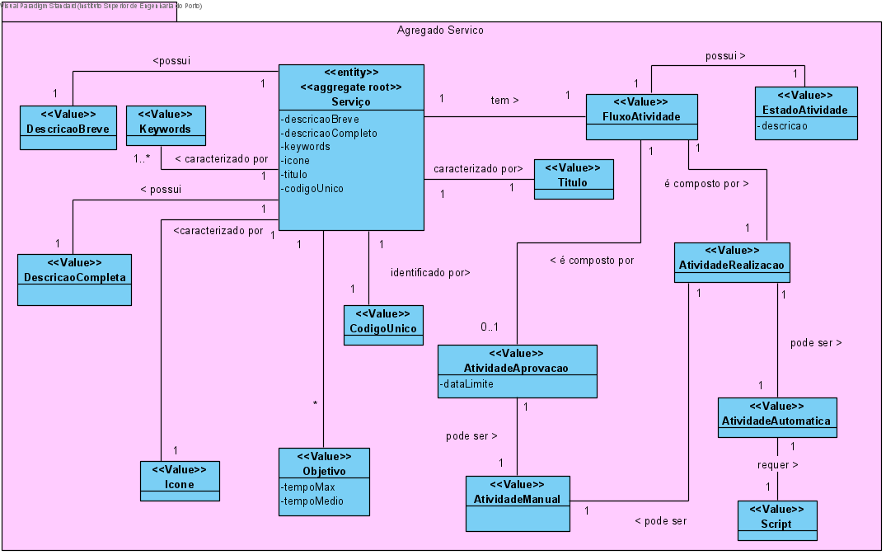
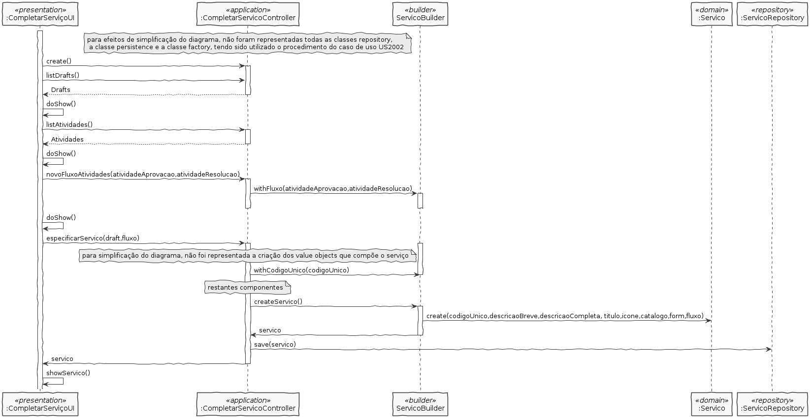
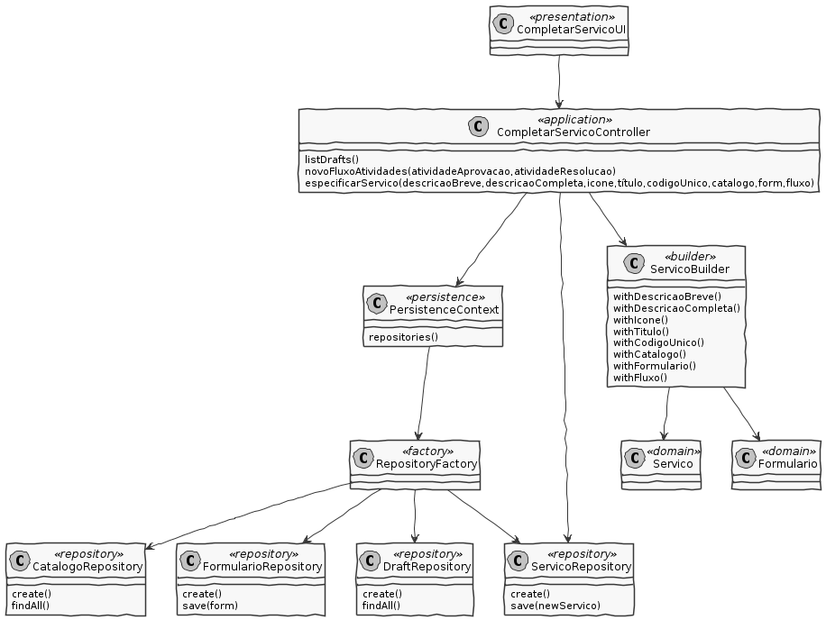

# US2003 - Continuar/Completar a especificação de um serviço

## 1. Requisitos

**US2003** Como GSH, eu pretendo continuar/completar a especificação em curso de um serviço.

## 2. Análise

* Para que um serviço fique completo, é necessária a adição de fluxos de atividade e a validação dos formulários.

### Excerto do Modelo de Domínio relevante para o caso de uso

## 3. Design

### 3.1 Realização da Funcionalidade

### 3.2 Diagrama de Classes

