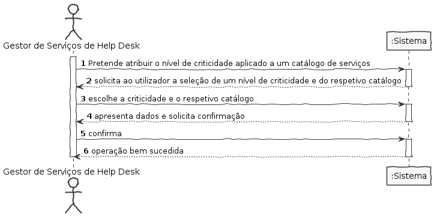
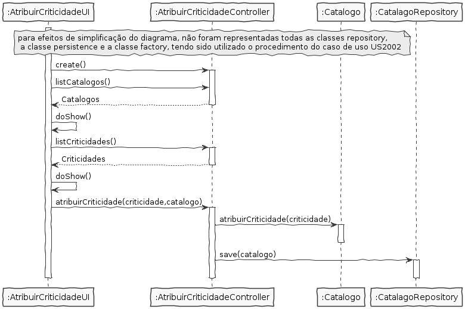
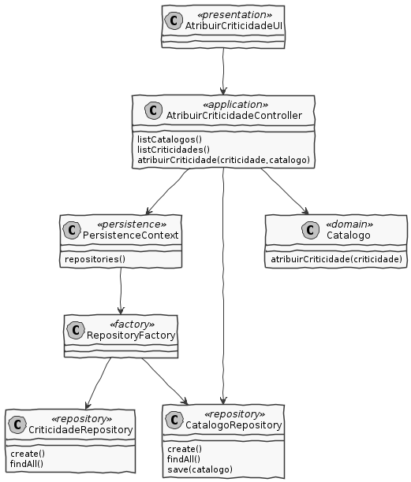

# US2012 - Atribuir nível de criticidade a um catálogo

## 1. Requisitos

**US2012** Como GSH, pretendo atribuir o nivel de criticidade aplicado a um catálogo de serviços.

## 2. Análise

### Excerto do Modelo de Domínio relevante para o caso de uso

## 3. Design

### 3.1 Realização da Funcionalidade

### 3.2 Diagrama de Classes

