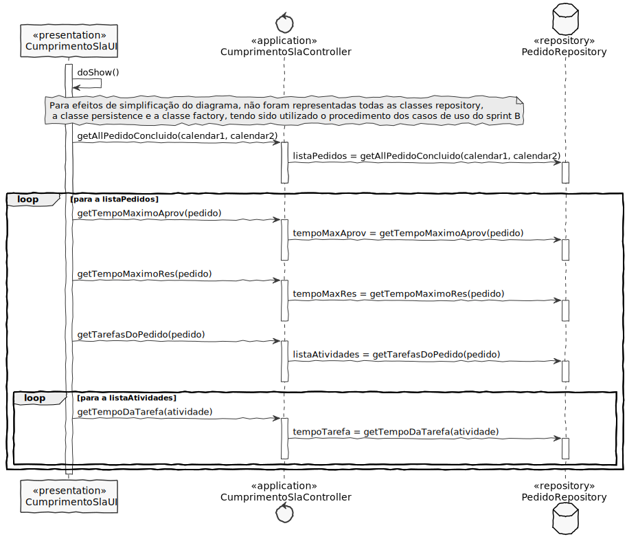

# US2013
=======================================

# 1. Requisitos

**US2013** Como GSH, eu pretendo obter uma listagem sobre o (in)cumprimento do SLA das solicitações recebidas e já concluídas num determinado intervalo de tempo.

A interpretação feita deste requisito foi no sentido de um GSH ser capaz de obter uma listagem sobre o (in)cumprimento do SLA das solicitações recebidas e já concluídas num determinado intervalo de tempo.

# 2. Análise

# 3. Design

## 3.1. Realização da Funcionalidade

Começamos por ir buscar uma lista de pedidos já completos ao repositório correspondente. Essa lista é percorrida de forma a conseguir obter tanto o tempo máximo para uma atividade de aprovação como para uma atividade de resolução de cada pedido da lista.

De seguida vamos buscar uma lista de atividades correspondentes a cada pedido, procuramos o seu tempo de realização e comparamos este tempo com o tempo máximo do pedido, de forma a averiguar se cumpre ou não o contrato SLA.

## 3.2. Diagrama de Classes

**CumprimentoSlaUI**- Classe responsável pela iteração entre o utilizador e o sistema.

**CumprimentoSlaController**- Classe é responsável por coordenar/distribuir as ações realizadas na User Interface (UI) com o resto do sistema.

**PedidoRepository**- Retorna uma lista de atividades pendentes de um utilizador, o pedido referente à atividade escolhida, o formulário referente à atividade.

## 3.3. Padrões Aplicados

* **Pure Fabrication** - criação da classe UI;

* **Controller** - atribui a responsabilidade de lidar com os eventos do sistema para uma classe que representa a um cenário de caso de uso do sistema global;

* **High cohesion/Low coupling** - menor dependência entre as classes;

* **Factory** - tem a responsabilidade de criar novos objetos;

* **Repository** - tem a responsabilidade de persistir e reconstruir objetos a partir da persistência;

## 3.4. Testes 

# 4. Implementação

# 5. Integração/Demonstração

# 6. Observações

