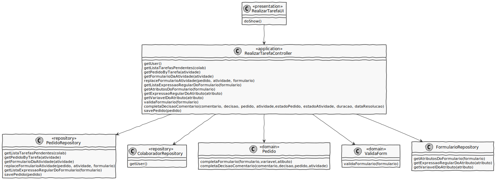

# US3023
=======================================

# 1. Requisitos

**US3023** Como utilizador, eu pretendo realizar uma tarefa que tenho como pendente.

A interpretação feita deste requisito foi no sentido de um utilizador ser capaz de realizar uma tarefa manual que tem como pendente.

# 2. Análise

* Consultar toda a informação disponível até ao momento no pedido em causa;
* Realizar algo fora do controlo do sistema em desenvolvimento (e.g., verificar elegibilidade do requerente, atuar sobre um sistema externo);
* Responder/Completar o formulário associada à respetiva tarefa, caso exista;
* Dar a tarefa por concluída, devendo o sistema garantir que os dados do formulário que foi respondido são todos válidos.
* As expressões da linguagem/gramática desenvolvida devem ser executadas/interpretadas (e.g. validação do formulário associado).

# 3. Design

## 3.1. Realização da Funcionalidade

Começamos por reconhecer o colaborador que está a acessar o programa. Em seguida, este utilizador consulta as suas tarefas pendentes que pretende realizar. Depois de escolhida a atividade pretendida, é mostrado ao utilizador as informações/dados do pedido em causa.

Em seguida, se a atividade selecionada tiver um formulário associado, o formulário referido será completo pelo utilizador. Uma vez finalizado o formulário, existe uma validação do mesmo.

O utilizador introduz um comentário e a sua decisão relativa à atividade.

Todas as novas informações da atividade são atualizadas.

## 3.2. Diagrama de Classes

**RealizarTarefaUI**- Classe responsável pela iteração entre o utilizador e o sistema.

**RealizarTarefaController**- Classe é responsável por coordenar/distribuir as ações realizadas na User Interface (UI) com o resto do sistema.

**PedidoRepository**- Retorna uma lista de atividades pendentes de um utilizador, o pedido referente à atividade escolhida, o formulário referente à atividade.

**FormularioRepository**- Retorna os atributos do formulário, a expressão regular de um atributo e variável do atributo.

**ColaboradorRepository**- Retorna o colaborador atual na sessão.

**Pedido**- Atualiza as informações da atividade realizada pelo utilizador.

**ValidaForm**- Valida o formulário da atividade.

## 3.3. Padrões Aplicados

* **Pure Fabrication** - criação da classe UI;

* **Controller** - atribui a responsabilidade de lidar com os eventos do sistema para uma classe que representa a um cenário de caso de uso do sistema global;

* **High cohesion/Low coupling** - menor dependência entre as classes;

* **Factory** - tem a responsabilidade de criar novos objetos;

* **Repository** - tem a responsabilidade de persistir e reconstruir objetos a partir da persistência;

## 3.4. Testes 

# 4. Implementação

Início da UI:

Preenchimento do formulário:

Controller:

Gramatica:

# 5. Integração/Demonstração

Iremos escolher realizar a seguinte atividade:

Demonstração:

A atividade após a sua realização:

# 6. Observações

