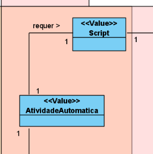
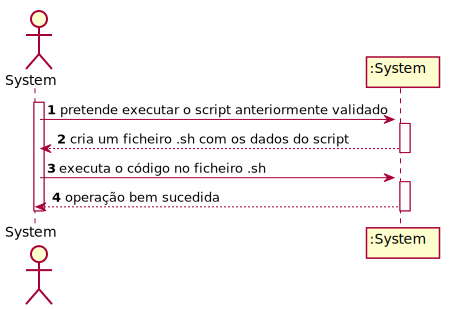

# US1007 - Atribuir Grau Satisfação
=======================================

# 1. Requisitos

**US1007** Como utilizador, eu pretendo transmitir o meu grau de satisfação sobre a resolução de um dado pedido por mim efetuado.

A interpretação feita deste requisito foi no sentido do utilizador ser capaz de atrubuir o grau de satisfacao dos seus pedidos.

# 2. Análise

# 3. Design

## 3.1. Realização da Funcionalidade

## 3.2. Diagrama de Classes

## 3.3. Padrões Aplicados

## 3.4. Testes 

# 4. Implementação

# 5. Integração/Demonstração

# 6. Observações

