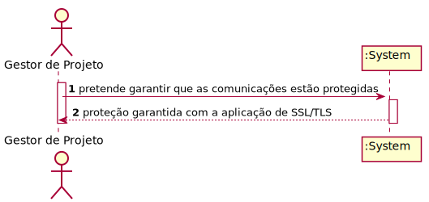
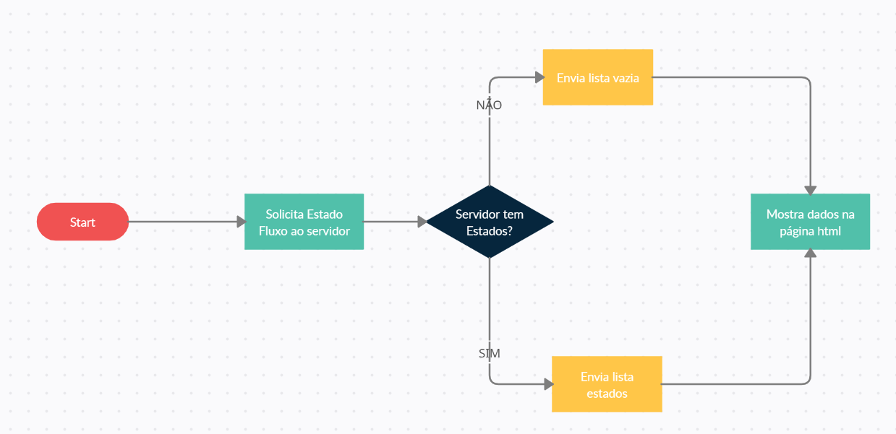

# US2102 - Proteger Comunicações
=======================================

# 1. Requisitos

**US2102** Como Gestor de Projeto, eu pretendo que as comunicações realizadas através do protocolo SDP2021 estejam protegidas.

A interpretação feita deste requisito foi no sentido de proteger as comunicações realizadas através do protocolo SDP2021.

# 2. Análise

# 3. Design

## 3.1. Realização da Funcionalidade

O fluxograma acima mostrado, demonstra o funcionamento da US.

## 3.2. Diagrama de Classes

## 3.3. Padrões Aplicados

## 3.4. Testes 

# 4. Implementação

# 5. Integração/Demonstração

# 6. Observações

