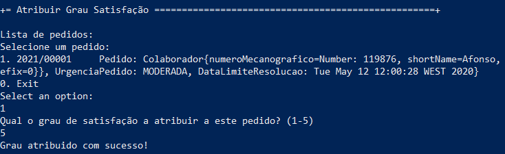

# US3051 - Atribuir Grau Satisfação
=======================================

# 1. Requisitos

**US3051** Como utilizador, eu pretendo transmitir o meu grau de satisfação sobre a resolução de um dado pedido por mim efetuado.

A interpretação feita deste requisito foi no sentido do utilizador ser capaz de atrubuir o grau de satisfacao dos seus pedidos.

# 2. Análise

# 3. Design

## 3.1. Realização da Funcionalidade

Começamos por reconhecer o colaborador que está a acessar o programa. Em seguida, este utilizador pode consultar os seus pedidos pendentes. Após a seleção de um deles pode atribuir um grau de satisfação para esse pedido.

## 3.2. Diagrama de Classes

**AtribuirGrauSatisfacaoUI**- Classe responsável pela iteração entre o utilizador e o sistema.

**AtribuirGrauSatisfacaoController**- Classe é responsável por coordenar/distribuir as ações realizadas na User Interface (UI) com o resto do sistema.

**PedidoRepository**- Retorna uma lista de pedidos pendentes de um utilizador.

**ColaboradorRepository**- Retorna o colaborador atual na sessão.

**Pedido**- Classe responsável por atribuir o grau de satisfação a um determinado pedido.

## 3.3. Padrões Aplicados

* **Pure Fabrication** - criação da classe UI;

* **Controller** - atribui a responsabilidade de lidar com os eventos do sistema para uma classe que representa a um cenário de caso de uso do sistema global;

* **High cohesion/Low coupling** - menor dependência entre as classes;

* **Factory** - tem a responsabilidade de criar novos objetos;

* **Repository** - tem a responsabilidade de persistir e reconstruir objetos a partir da persistência;

## 3.4. Testes 

As classes criadas/atualizadas para implementação de testes nesta US foram:

**GrauSatisfacaoTest**- Classe responsável pelos testes da classe GrauSatisfacao.

**PedidoTest**- Nesta classe foi adicionado um método para testar a atribuição do grau.

# 4. Implementação

Aqui é apresentada a UI onde a lista de pedidos é apresentada e a atribuição do grau é feita.

Aqui é apresentado o Controller onde estão todos os métodos necessários.

# 5. Integração/Demonstração

Aqui é apresentado o procedimento normal onde existem pedidos para atribuir grau e o processo de atribuição do mesmo.

Aqui é apresentado a mensagem de aviso quando não existem pedidos para atribuir grau.

# 6. Observações

