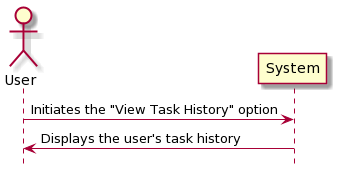
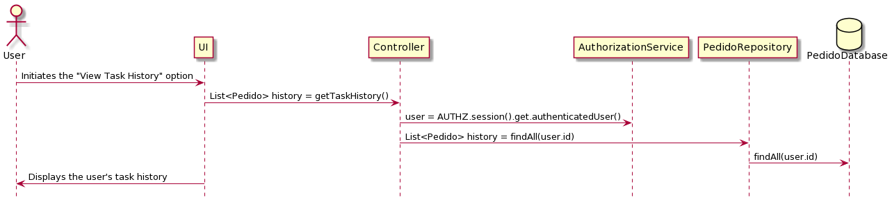
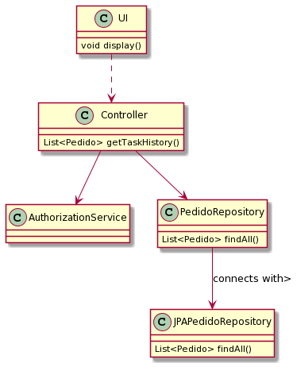

# US3031
---

# 1. Requisitos

**US3031** Como utilizador, eu pretendo consultar os meus pedidos (em curso ou o histórico) e respetivos detalhes/estado.

# 2. Análise

# 3. Design

## 3.1. Realização da Funcionalidade

## 3.2. Diagrama de Classes

## 3.3. Padrões Aplicados

## 3.4. Testes 

# 4. Implementação

# 5. Integração/Demonstração
* Quando o colaborador não tem pedidos efetuados nem histórico

* Quando efetuado

# 6. Observações
