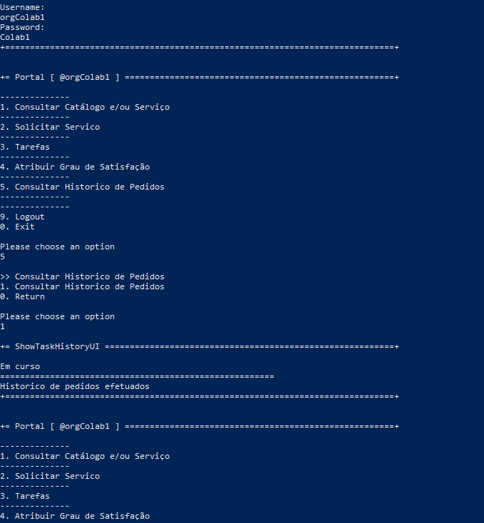
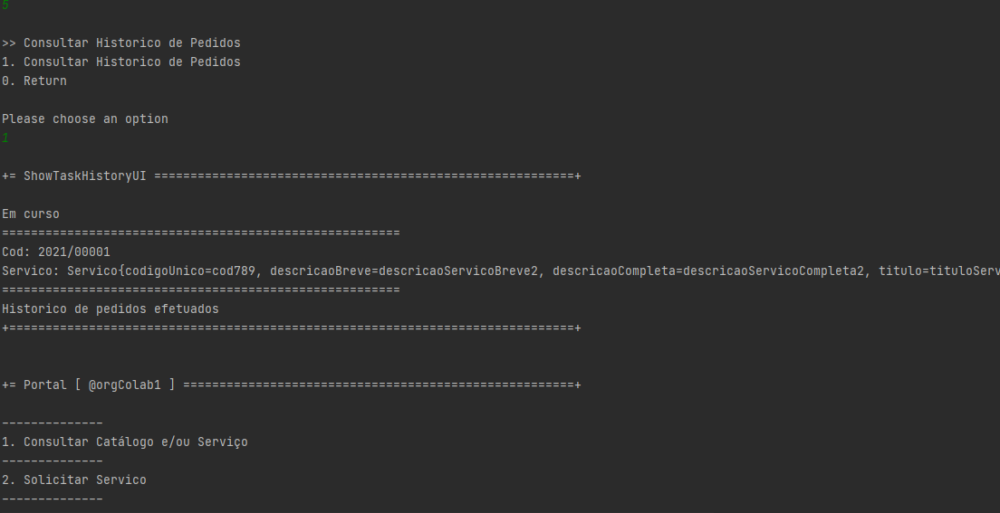

# US3031
---

# 1. Requisitos

**US3031** 

Como utilizador, eu pretendo consultar os meus pedidos (em curso ou o histórico) e respetivos detalhes/estado.

# 2. Análise

# 3. Design

## 3.1. Realização da Funcionalidade

## 3.2. Diagrama de Classes

## 3.3. Testes 
Não foram implementados métodos para este caso de uso.

# 4. Implementação

A implemenração divide-se em duas parte:

**getUsersTaskHistory** 
* Obtenção da sessão do utilizador
* Obtenção do Colaborador através da sessão 
* Invocação de query
* Return à lista

**getUsersOnGoingTaks** 
* Obtenção da sessão do utilizador
* Obtenção do Colaborador através da sessão 
* Invocação de query
* Return à lista

# 5. Integração/Demonstração
* Quando o colaborador não tem pedidos efetuados nem histórico

* Quando efetuado

# 6. Observações

Nesta abordagem, podia ser definido uma variável para o armazenamento temporário do Objeto Colaborador, obtido pela sessão do utilizador, levando assim a uma maior agilização e menor uso de recursos.

Neste caso, os métodos implementados fazem basicamente o mesmo, diferenciando apenas a query invocada.

A abordagem tomada faz com que sejam efetuadas linhas de comando repetidas, e queries por consequência.
