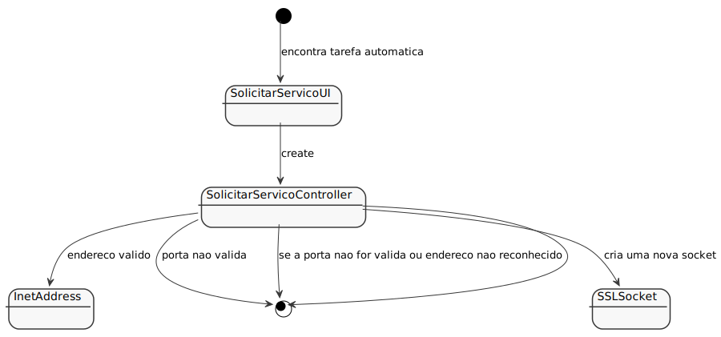

# US2102
=======================================

# 1. Requisitos

**US2102** Como Gestor de Projeto, eu pretendo que as comunicações realizadas através do protocolo SDP2021 estejam protegidas.

A interpretação feita deste requisito foi no sentido das comunicações realizadas através do protocolo SDP2021 estarem protegidas.

# 2. Análise

* De forma a assegurar que as comunicações realizadas através do protocolo SDP2021 estejam protegidas na aplicação dos Serviços e RH, aplicamos SSL/TLS com autenticação mútua baseada em certificados de chave pública.

# 3. Design

## 3.1. Realização da Funcionalidade

## 3.2. Diagrama de Classes

## 3.3. Padrões Aplicados

## 3.4. Testes 

# 4. Implementação

# 5. Integração/Demonstração

# 6. Observações

