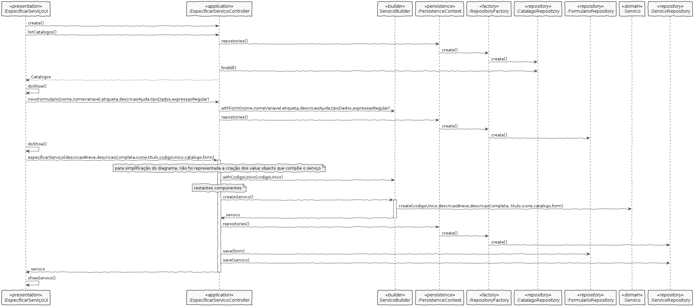

# Design

## Classes do domínio:

* Serviço
* Descricao
* Ícone
* Título
* CodigoUnico
* Catálogo
* Formulario

Serviço é um agregado independente de Catálogo

* Relação unidirecional many-to-one
* Cascade NONE
* Fetch EAGER

Serviço é um agregado independente de Formulário

* Relação unidirecional one-to-one

CodigoUnico é um value object que faz parte do agregado Serviço

* Relação unidirecional one-to-one
* Cascade ALL
* Fetch EAGER

Titulo é um value object que faz parte do agregado Serviço

* Relação unidirecional one-to-one
* Cascade ALL
* Fetch EAGER

Descrição é um value object que faz parte do agregado Serviço

Icone é um value object que faz parte do agregado Serviço

* Relação unidirecional one-to-one
* Cascade ALL
* Fetch EAGER

Controlador: EspecificarServicoController
Repository: ServicoRepository

## Diagrama de Sequência
