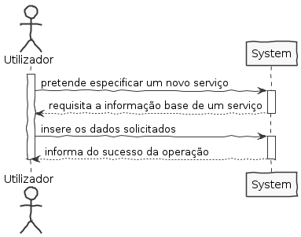
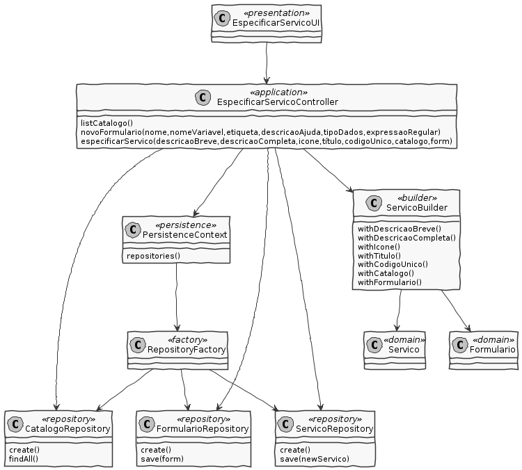

# US2002 - Especificar Serviço

## 1. Requisitos

**US2002** Como GSH, eu pretendo proceder à especificação de um novo serviço, devendo o sistema permitir que a mesma fique incompleta e seja, posteriomente, retomada.

# 2. Análise

* Um serviço é caracterizado por um código único, um título, uma descrição breve, uma descrição completa, um ícone, um conjunto de palavras-chave (keywords) e o catálogo onde é disponibilizado.

* Além disso, para este sprint, é necessário definir dados sobre o formulário de solicitação de serviço.

## Regras de Negócio

* O código do serviço é alfa-numérico, case-insensitive e introduzido manualmente
* Ambas as descrições do serviço são obrigatórias
* A descrição breve do serviço tem um tamanho máximo de de 40 caracteres, enquanto que a descrição completa tem um tamanho máximo de 500 caracteres
* O identificador do formulário é atribuído automaticamente
* O nome do formulário tem um tamanho máximo de 50 caracteres

# 3. Design

## Classes do domínio:

* Serviço
* Descricao
* Ícone
* Título
* CodigoUnico
* Catálogo
* Formulario

Serviço é um agregado independente de Catálogo

* Relação unidirecional many-to-one
* Cascade NONE
* Fetch EAGER

Serviço é um agregado independente de Formulário

* Relação unidirecional one-to-one

CodigoUnico é um value object que faz parte do agregado Serviço

* Relação unidirecional one-to-one
* Cascade ALL
* Fetch EAGER

Titulo é um value object que faz parte do agregado Serviço

* Relação unidirecional one-to-one
* Cascade ALL
* Fetch EAGER

Descrição é um value object que faz parte do agregado Serviço

Icone é um value object que faz parte do agregado Serviço

* Relação unidirecional one-to-one
* Cascade ALL
* Fetch EAGER

Controlador: EspecificarServicoController
Repository: ServicoRepository

## 3.1 Realização da Funcionalidade

## 3.2 Diagrama de Classes

