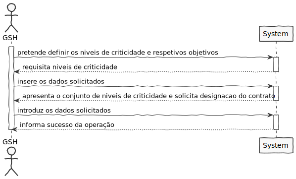
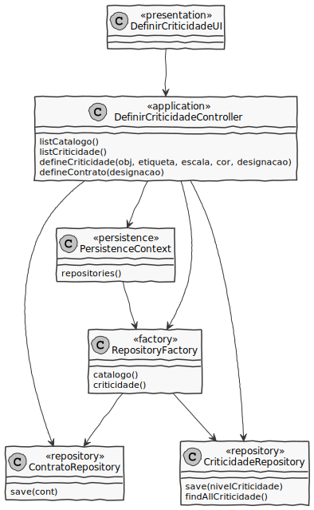
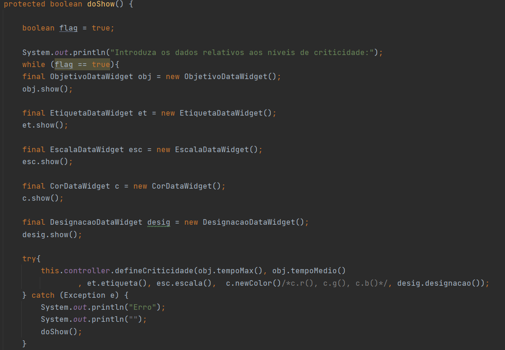
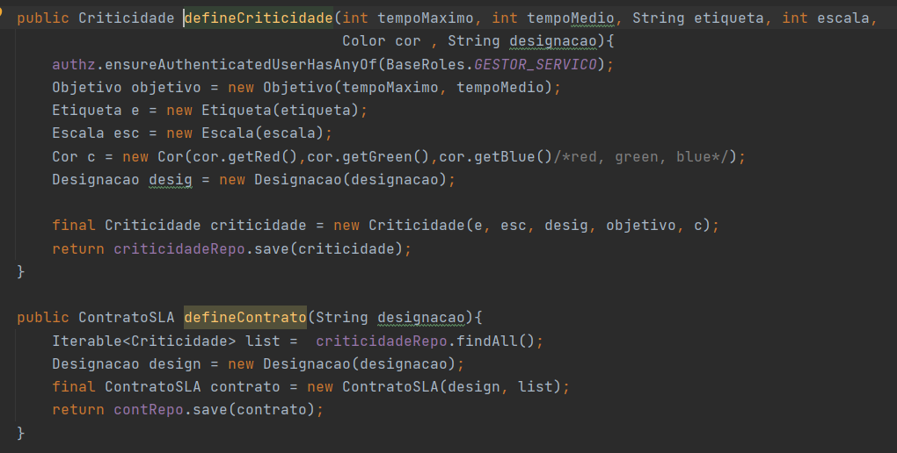

# US2010 - Definir os niveis de criticidade e respetivos objetivos
=======================================

# 1. Requisitos

*Nesta secção a equipa deve indicar a funcionalidade desenvolvida bem como descrever a sua interpretação sobre a mesma e sua correlação e/ou dependência de/com outros requisitos.*

*Exemplo*

**US2010** Como GSH, eu pretendo definir os niveis de criticidade e respetivos objetivos aplicados na organização para definição de SLAs.

A interpretação feita deste requisito foi no sentido de um Gestor de Serviços de Help desk conseguir definir os niveis de criticidade e os seus objetivos aplicados na organização para definição de SLAs.

# 2. Análise

*Neste secção a equipa deve relatar o estudo/análise/comparação que fez com o intuito de tomar as melhores opções de design para a funcionalidade bem como aplicar diagramas/artefactos de análise adequados.*
*Recomenda-se que organize este conteúdo por subsecções.*

2.1 Regras de Negócio
* Um nível de criticidade caracteriza-se por uma etiqueta (e.g. baixa, média, elevada), um valor numa escala numérica de inteiros, uma cor indicativa de gravidade e respetivos objetivos, i.e., os tempos máximos e médios a serem satisfeitos tanto na aprovação como na resolução de uma solicitação com este nível de criticidade;
* Um contrato de SLA assenta essencialmente na definição de um conjunto de níveis de
criticidade e dos respetivos objetivos.

# 3. Design

*Nesta secção a equipa deve descrever o design adotado para satisfazer a funcionalidade. Entre outros, a equipa deve apresentar diagrama(s) de realização da funcionalidade, diagrama(s) de classes, identificação de padrões aplicados e quais foram os principais testes especificados para validar a funcionalidade.*

*Para além das secções sugeridas, podem ser incluídas outras.*

## 3.1. Realização da Funcionalidade

*Nesta secção deve apresentar e descrever o fluxo/sequência que permite realizar a funcionalidade.*

Começamos por criar a ligação ao repositório da criticidade e ao repositório dos contratos para posteriormente ser possível definir níveis de criticidade e os seus objetivos e a criação de um contrato SLA.

O utilizador introduz os dados solicitados para a definição de um nível de criticidade, sendo possível registar vários níveis de criticidade. Assim, cada nível de criticidade será guardado no repositório da criticidade.

Desta forma, a partir do repositório da criticidade é possível encontrar os níveis de criticidade registados. Com uma lista destes dados é criado um contrato SLA que é guardado no repositório dos contratos.

## 3.2. Diagrama de Classes

*Nesta secção deve apresentar e descrever as principais classes envolvidas na realização da funcionalidade.*

**DefinirCriticidadeUI**- Classe responsável pela iteração entre o GSH e o sistema.

**DefinirCriticidadeController**- Classe é responsável por coordenar/distribuir as ações realizadas na User Interface (UI) com o resto do sistema.

**ContratoRepository**- Guarda a informação respetiva ao contrato SLA criado.

**CriticidadeRepository**- Guarda a informação respetiva aos níveis de criticidade e objetivos criados.

**Objetivo**- Cria a instância Objetivo para posteriormente ser persistida.

**Cor**- Cria a instância Cor para posteriormente ser persistida.

**Etiqueta**- Cria a instância Etiqueta para posteriormente ser persistida.

**Escala**- Cria a instância Escala para posteriormente ser persistida.

**Designacao**- Cria a instância Designacao para posteriormente ser persistida.

**Criticidade**- Cria a instância Criticidade para posteriormente ser persistida.

**ContratoSLA**- Cria a instância Contrato para posteriormente ser persistida.

## 3.3. Padrões Aplicados

*Nesta secção deve apresentar e explicar quais e como foram os padrões de design aplicados e as melhores práticas.*

* **Pure Fabrication** - criação da classe UI;

* **Controller** - atribui a responsabilidade de lidar com os eventos do sistema para uma classe que representa a um cenário de caso de uso do sistema global;

* **High cohesion/Low coupling** - menor dependência entre as classes;

* **Factory** - tem a responsabilidade de criar novos objetos;

* **Repository** - tem a responsabilidade de persistir e reconstruir objetos a partir da persistência;

## 3.4. Testes 

# 4. Implementação

## 4.1. UI
Aqui é demonstrado parte do método doShow() existente na UI desta US.

## 4.2. Controller
Aqui é demonstrado o Controller da US com os métodos principais.

# 5. Integração/Demonstração

# 6. Observações

