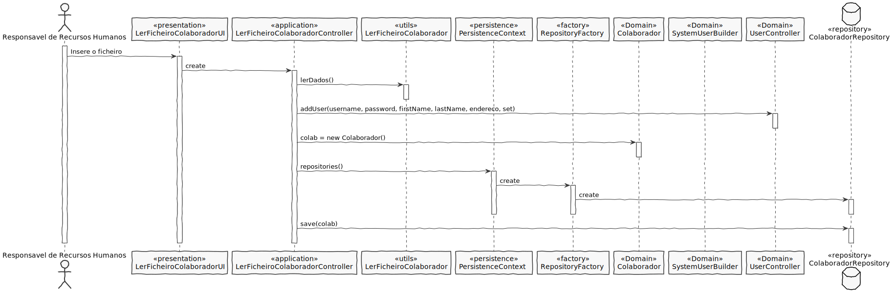
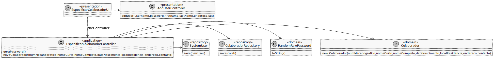

# US2051
=======================================

# 1. Requisitos

**US2001** Como Resonsável de Recursos Humanos (RRH), pretendo especificar um colaborador.

A interpretação feita deste requisito foi no sentido do Responsável de Recursos Humanos conseguir especificar um colaborador tanto pelo terminal como através de um ficheiro.

# 2. Análise

# Análise

* O colaborador é caracterizado por o número mecanografico, nome curto, nome completo, data nascimento, contacto, local de residencia e endereço.

# Regras de Negócio

* O número mecanografico tem 6 números
* O nome curto não pode estar vazio
* O nome completo não pode estar vazio
* A residência não pode estar vazia
* A data tem que estar no formato YYYY/MM/DD onde o dia não pode ser maior de 32 e tem que ser maior que 0, mês tem que ser maior do que 0 e menor do que 13, e o ano não pode ser menor do que 0 e maior do que 2022
* O endereço de email tem que estar no formato certo e não pode ser vazio

# 3. Design

##Classes de domínio:

* Colaborador
* MecanographicNumber
* ShortName
* FullName
* LocalResidencia
* Data
* EmailAddress
* Contacto

MecanographicNumber é um value object que faz parte do agregado Colaborador

* Relação unidirecional one-to-one
* Cascade ALL
* Fetch EAGER

ShortName é um value object que faz parte do agregado Catalogo

* Relação unidirecional one-to-one
* Cascade ALL
* Fetch EAGER

FullName é um value object que faz parte do agregado Catalogo

* Relação unidirecional one-to-one
* Cascade ALL
* Fetch EAGER

LocalResidencia é um value object que faz parte do agregado Catalogo

* Relação unidirecional one-to-one
* Cascade ALL
* Fetch EAGER

Data é um value object que faz parte do agregado Catalogo

* Relação unidirecional one-to-one
* Cascade ALL
* Fetch EAGER

EmailAddress é um value object que faz parte do agregado Catalogo

* Relação unidirecional one-to-one
* Cascade ALL
* Fetch EAGER

Contacto é um value object que faz parte do agregado Catalogo

* Relação unidirecional one-to-one
* Cascade ALL
* Fetch EAGER

Controlador: EspecificarColaboradorController
	     LerFicheiroColaboradorController

Repository: ColaboradorRepository
	    User

## 3.1. Realização da Funcionalidade

_Ficheiro

## 3.2. Diagrama de Classes

## 3.3. Padrões Aplicados

* **Controller** - atribui a responsabilidade de lidar com os eventos do sistema para uma classe que representa a um cenário de caso de uso do sistema global;

* **Information Expert** - classe possui os seus próprios dados;

* **High cohesion/Low coupling and ** - menor dependência entre as classes.

* **Factory** - tem a responsabilidade de criar novos objetos.

* **Repository** - tem a responsabilidade de persistir e reconstruir objetos a partir da persistência.

## 3.4. Testes 
*Nesta secção deve sistematizar como os testes foram concebidos para permitir uma correta aferição da satisfação dos requisitos.*

**Teste 1:** Verificar que não é possível criar uma instância da classe Exemplo com valores nulos.

	@Test(expected = IllegalArgumentException.class)
		public void ensureNullIsNotAllowed() {
		Exemplo instance = new Exemplo(null, null);
	}

# 4. Implementação

*Nesta secção a equipa deve providenciar, se necessário, algumas evidências de que a implementação está em conformidade com o design efetuado. Para além disso, deve mencionar/descrever a existência de outros ficheiros (e.g. de configuração) relevantes e destacar commits relevantes;*

*Recomenda-se que organize este conteúdo por subsecções.*

# 5. Integração/Demonstração

*Nesta secção a equipa deve descrever os esforços realizados no sentido de integrar a funcionalidade desenvolvida com as restantes funcionalidades do sistema.*

# 6. Observações

*Nesta secção sugere-se que a equipa apresente uma perspetiva critica sobre o trabalho desenvolvido apontando, por exemplo, outras alternativas e ou trabalhos futuros relacionados.*