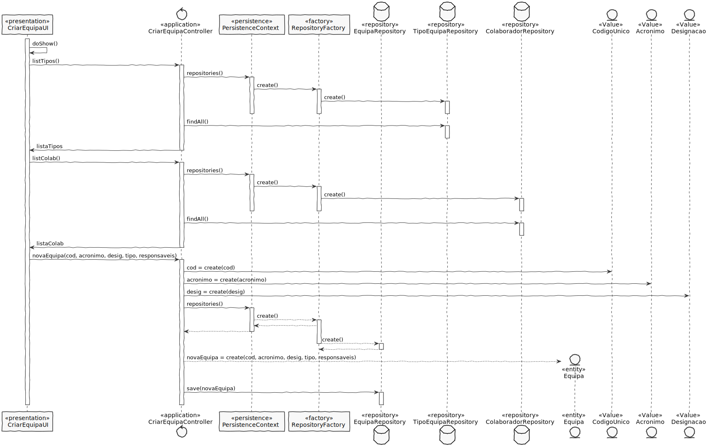
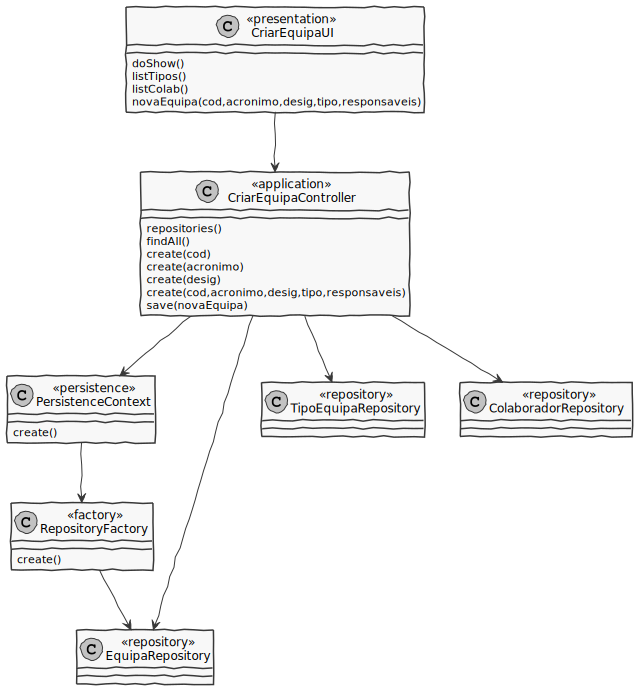

# US2052
=======================================

# 1. Requisitos

**US2052** Como Responsável de Recursos Humanos (RRH), eu pretendo criar uma nova equipa.

A interpretação feita deste requisito foi no sentido de Responsável de Recursos Humanos conseguir criar uma nova equipa.

# 2. Análise

# Análise

* A equipa é caracterizada por um código único, um acrónimo da equipa, uma designação da equipa, um tipo de equipa e uma lista de colaboradores responsáveis por essa equipa.

# Regras de Negócio

* O código único é introduzido.
* O acrónimo é único.
* O acrónimo é alfanumérico.
* O acrónimo da equipa tem um tamanho máximo de 10 caracteres.
* A designação da equipa tem um tamanho máximo de 50 caracteres.
* A lista de colaboradores responsáveis pode ter um ou mais colaboradores.

# 3. Design

##Classes de domínio:

* Equipa
* CodigoUnico
* Acronimo
* Designacao
* TipoEquipa
* Colaborador

CodigoUnico é um value object que faz parte do agregado Equipa

* Relação unidirecional one-to-one

Acronimo é um value object que faz parte do agregado Equipa

* Relação unidirecional one-to-one

Designacao é um value object que faz parte do agregado Equipa

* Relação unidirecional one-to-one

TipoEquipa é uma entity que faz parte do agregado Equipa

* Relação unidirecional one-to-one
* Cascade ALL

Colaborador é uma entity que faz parte do agregado Colabordaor

* Relação unidirecional many-to-many
* Fetch EAGER

Controlador: CriarEquipaController

Repository: EquipaRepository
	    ColaboradorRepository
	    TipoEquipaRepository

## 3.1. Realização da Funcionalidade

Comecamos por criar uma ligação com o repositório do tipo de equipa para posteriormente apresentar a lista de tipos para ser possível qual o tipo da equipa que irá ser criada.
De seguida cria a ligação ao repositório do colaborador para posteriormente apresentar a lista de colaboradores para ser possível escolher o(s) colaborador(es) responsáveis pela equipa que irá ser criada.
O utilizador insere os dados solicitados em relação à criação da equipa.
Após a criação da equipa, a mesma é guardada no repositório referente às equipas.

## 3.2. Diagrama de Classes

*CriarEquipaUI*
Classe responsável pela iteração entre o utilizador e o sistema.

*CriarEquipaController*
Classe responsável por lidar com os eventos do sistema.

*Equipa*
Cria a instância Equipa para posteriormente ser persistida.

*TipoEquipaRepository*
Retorna a lista de tipos de equipa para serem selecionados para a equipa.

*ColaboradorRepository*
Retorna a lista de colaboradores para serem selecionados para a equipa.

## 3.3. Padrões Aplicados

* **Controller** - atribui a responsabilidade de lidar com os eventos do sistema para uma classe que representa a um cenário de caso de uso do sistema global;

* **Information Expert** - classe possui os seus próprios dados;

* **High cohesion/Low coupling and ** - menor dependência entre as classes.

* **Factory** - tem a responsabilidade de criar novos objetos.

* **Repository** - tem a responsabilidade de persistir e reconstruir objetos a partir da persistência.

## 3.4. Testes 

# 4. Implementação

*Nesta secção a equipa deve providenciar, se necessário, algumas evidências de que a implementação está em conformidade com o design efetuado. Para além disso, deve mencionar/descrever a existência de outros ficheiros (e.g. de configuração) relevantes e destacar commits relevantes;*

*Recomenda-se que organize este conteúdo por subsecções.*

# 5. Integração/Demonstração

*Nesta secção a equipa deve descrever os esforços realizados no sentido de integrar a funcionalidade desenvolvida com as restantes funcionalidades do sistema.*

# 6. Observações

*Nesta secção sugere-se que a equipa apresente uma perspetiva critica sobre o trabalho desenvolvido apontando, por exemplo, outras alternativas e ou trabalhos futuros relacionados.*

