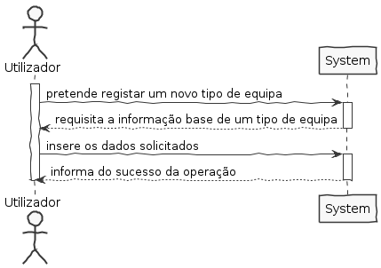
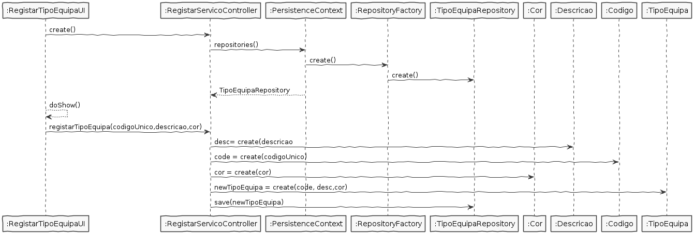
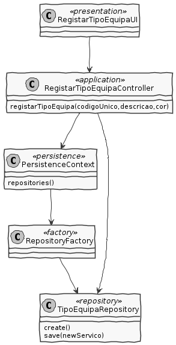

# US2054 - Registar Novo Tipo de Equipa

## 1. Requisitos

**US2054** Como RRH, eu pretendo registar um novo tipo de equipa.

## 2. Análise

* Um tipo de equipa é caracterizado por um código único interno, por uma descrição e por uma cor.

### Regras de Negócio

* O código único interno é alfanumérico e com um máximo de 15 caracteres.
* A descrição do tipo de equipa tem um tamanho máximo de 50 caracteres.
* Cada tipo de equipa tem uma cor distinta.

## 3. Design

### Classes do domínio:

* TipoEquipa
* Descricao
* CodigoUnico
* Cor

Descricao é um value object que faz parte do agregado TipoEquipa

* Relação unidirecional one-to-one
* Cascade ALL
* Fetch EAGER

CodigoUnico é um value object que faz parte do agregado Serviço

* Relação unidirecional one-to-one
* Cascade ALL
* Fetch EAGER

Cor é um value object que faz parte do agregado Serviço

Controlador: RegistarTipoEquipaController
Repository: TipoEquipaRepository

### 3.1 Realização da Funcionalidade

### 3.2 Diagrama de Classes

### 3.2.1 Principais classes envolvidas

## 3.3 Padrões Aplicados

## 3.4 Testes

# 4. Implementação

# 5. Integração/Demonstração

# 6. Observações