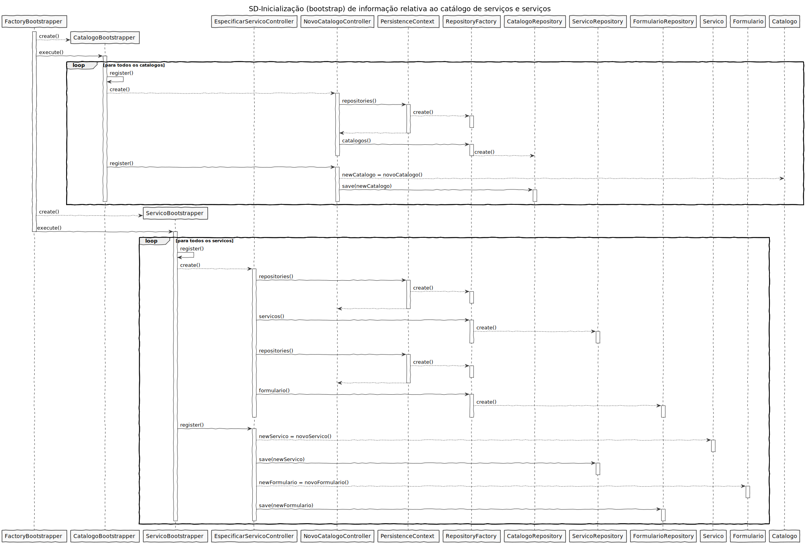
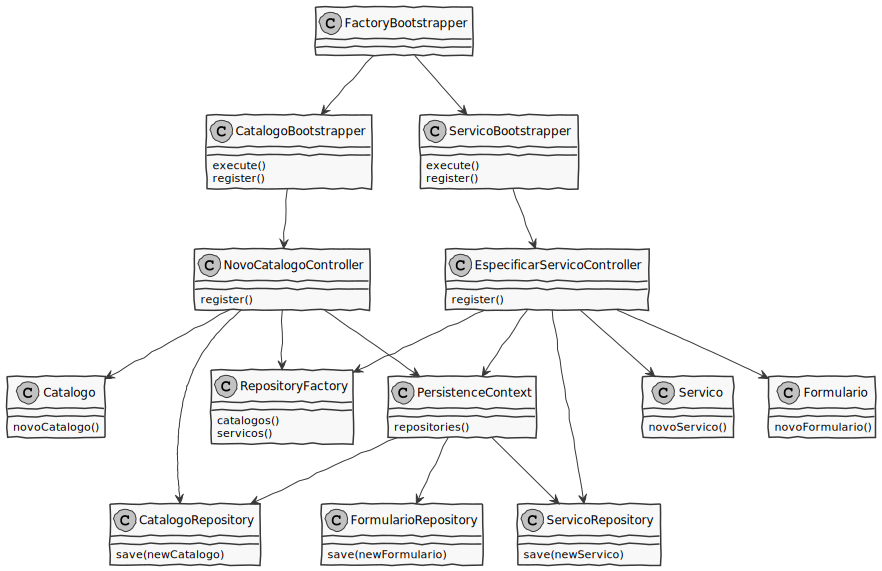

# US2101 - Inicialização (bootstrap) de informação relativa ao catálogo de serviços e serviços
=======================================

# 1. Requisitos

*Nesta secção a equipa deve indicar a funcionalidade desenvolvida bem como descrever a sua interpretação sobre a mesma e sua correlação e/ou dependência de/com outros requisitos.*

*Exemplo*

**US2101** Como Gestor de Projeto, eu pretendo que, para efeitos de demonstração, o sistema contemple a possibilidade de ser inicializado (bootstrap) com alguma informação relativa à catálogo de serviços e serviços.

A interpretação feita deste requisito foi no sentido de que o sistema carregue algumas informações relativas ao catálogo de serviços e serviços.

# 2. Análise

*Neste secção a equipa deve relatar o estudo/análise/comparação que fez com o intuito de tomar as melhores opções de design para a funcionalidade bem como aplicar diagramas/artefactos de análise adequados.*

*Recomenda-se que organize este conteúdo por subsecções.*

Neste US não houve necessidade de alterar o modelo de domínio. Para este US é essencial que o US2001 e US2002 estejam já implementados.
Será feito um boostrap de catálogos de serviços e serviços com o intuito de não ser preciso introduzir todas as informações sempre que o programa seja testado.

# 3. Design

*Nesta secção a equipa deve descrever o design adotado para satisfazer a funcionalidade. Entre outros, a equipa deve apresentar diagrama(s) de realização da funcionalidade, diagrama(s) de classes, identificação de padrões aplicados e quais foram os principais testes especificados para validar a funcionalidade.*

*Para além das secções sugeridas, podem ser incluídas outras.*

## 3.1. Realização da Funcionalidade

*Nesta secção deve apresentar e descrever o fluxo/sequência que permite realizar a funcionalidade.*

Foi criada a classe CatalogoBootstrapper e ServicoBootstrapper que faz uso do NovoCatalogoCTRL e EspecificarServicoController, respetivamente, para criar instâncias e guardá-las no CatalogoRepository e ServicoRepository de forma a garantir as regras de negócio dadas pelo cliente.

Desta forma não é necessário a utilização de uma UI.

## 3.2. Diagrama de Classes

*Nesta secção deve apresentar e descrever as principais classes envolvidas na realização da funcionalidade.*

### 3.2.1 Principais classes envolvidas
**FactoryBootstrapper**- Classe responsável pela crição do CatalogoBootstrapper e ServicoBootstrapper
**CatalogoBootstrapper**-
**ServicoBootstrapper**-
**NovoCatalogoCTRL**- Classe é responsável por coordenar/distribuir as ações relativas ao catálogo realizadas na User Interface (UI) com o resto do sistema.
**EspecificarServicoController**- Classe é responsável por coordenar/distribuir as ações relativas ao serviço realizadas na User Interface (UI) com o resto do sistema.
**CatalogoRepository**- Guarda a informação respetiva ao catálogo criado.
**ServicoRepository**- Guarda a informação respetiva ao serviço criado.
**Catalogo**- Cria a instância Catalogo para posteriormente ser persistida.
**Servico**- Cria a instância Servico para posteriormente ser persistida.

## 3.3. Padrões Aplicados

*Nesta secção deve apresentar e explicar quais e como foram os padrões de design aplicados e as melhores práticas.*

* **Controller** - atribui a responsabilidade de lidar com os eventos do sistema para uma classe que representa a um cenário de caso de uso do sistema global;

* **Information Expert** - classe possui os seus próprios dados;

* **High cohesion/Low coupling** - menor dependência entre as classes.

* **Factory** - tem a responsabilidade de criar novos objetos.

* **Repository** - tem a responsabilidade de persistir e reconstruir objetos a partir da persistência.

## 3.4. Testes 
*Nesta secção deve sistematizar como os testes foram concebidos para permitir uma correta aferição da satisfação dos requisitos.*

**Teste 1:** Verificar que não é possível criar uma instância da classe Exemplo com valores nulos.

	@Test(expected = IllegalArgumentException.class)
		public void ensureNullIsNotAllowed() {
		Exemplo instance = new Exemplo(null, null);
	}

# 4. Implementação

*Nesta secção a equipa deve providenciar, se necessário, algumas evidências de que a implementação está em conformidade com o design efetuado. Para além disso, deve mencionar/descrever a existência de outros ficheiros (e.g. de configuração) relevantes e destacar commits relevantes;*

*Recomenda-se que organize este conteúdo por subsecções.*

# 5. Integração/Demonstração

*Nesta secção a equipa deve descrever os esforços realizados no sentido de integrar a funcionalidade desenvolvida com as restantes funcionalidades do sistema.*

# 6. Observações

*Nesta secção sugere-se que a equipa apresente uma perspetiva critica sobre o trabalho desenvolvido apontando, por exemplo, outras alternativas e ou trabalhos futuros relacionados.*

